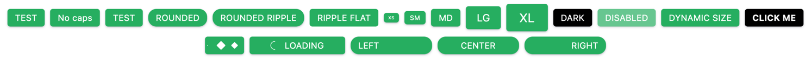

# Button for Vue 3



## Project setup
```
yarn add @021-projects/vue-button
```

### Usage
```vue
import VueButton from '@021-projects/vue-button'
import '@021-projects/vue-button/dist/style.css'

...
components: { VueButton }
...
```

```vue
<vue-button label="Test" />
<vue-button label="No caps" no-caps />
<vue-button label="Test" class="custom-btn" />
<vue-button label="Rounded" rounded />
<vue-button label="Rounded ripple" rounded ripple />
<vue-button label="Ripple flat" ripple flat />

<vue-button label="Small" size="sm" />
<vue-button label="Medium" size="md" />
<vue-button label="Large" size="lg" />

<vue-button label="Dark" color="black" text-color="white" />

<vue-button color="black" text-color="white" @click="showAlert"><b>Click me</b></vue-button>

<!-- loading is var from component data -->
<vue-button :loading="loading" label="LOad" @click="loading = !loading" />
<vue-button loading label="Custom loading" @click="showAlert">
  <template #loading="{ spinnerStyle }">
    <spring-spinner v-bind="spinnerStyle" />
    <span style="padding-left: 10px">Loading</span>
  </template>
</vue-button>

<vue-button label="Left" align="left" style="width: 150px" rounded />
<vue-button label="Center" align="center" style="width: 150px" rounded />
<vue-button label="Right" align="right" style="width: 150px" rounded />
```

### Properties
```typescript
/**
 * Text alignment for label
 */
align: {
  type: String as PropType<'left' | 'center' | 'right'>,
  default: 'center'
},

/**
 * Button title 
 */
label: {
  type: String,
  default: ''
},

/**
 * Button size. Allowed xs, sm, md, lg, xl
 */
size: {
  type: String as PropType<TSize>,
  default: 'md'
},

/**
 * Button (background) color
 */
color: {
  type: String,
  default: '#27ae60'
},

/**
 * Button text color
 */
textColor: {
  type: String,
  default: '#fff'
},

/**
 * Rounded borders for button
 */
rounded: {
  type: Boolean,
  default: false
},

/**
 * Ripple effect on click
 */
ripple: {
  type: Boolean,
  default: false
},

/**
 * No shadow 
 */
flat: {
  type: Boolean,
  default: false
},

/**
 * No upppercase text transform 
 */
noCaps: {
  type: Boolean,
  default: false
},

/**
 * Disabled state
 * If true, button will ignore click event
 * And will look like disabled
 */
disabled: {
  type: Boolean,
  default: false
}

/**
 * Loading state
 * If true, button will ignore click event
 * And will show loading spinner instead of label
 * 
 * Spinner can be replaced in "loading" slot
 */
loading: {
  type: Boolean,
  default: false
},

/**
 * Duration of loading spinner animation
 * Works only if spinner was not replaced in "loading" slot
 */
loadingAnimationDuration: {
  type: Number,
  default: 2500
}
```